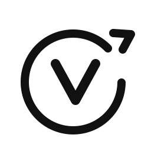

# VentureOS

<p align="left">
  
</p>

VentureOS è un sistema agentico **run-centric** che trasforma una nicchia in output operativi per validare e lanciare micro-business, mantenendo checkpoint di approvazione umana sui passaggi critici.

## Scopo del progetto

Ridurre il tempo tra "idea" e "piano eseguibile" con una pipeline unica che produce:
- ricerca mercato e segnali domanda,
- VoC strutturata (pain, desideri, obiezioni, linguaggio reale),
- trigger map emotiva/logica,
- idee business con scoring e shortlist,
- analisi PnL-lite + risk memo,
- social pack 30 giorni,
- roadmap 30/60/90 con backlog.

## Principi chiave

- **Human-in-the-loop**: i checkpoint decisionali richiedono approvazione.
- **Compliance-first**: guardrail e policy check prima di ogni output sensibile.
- **Auditability**: ogni azione è tracciata in audit log.
- **Ripetibilità**: run versionate e confrontabili.

## Workflow VentureOS

`Input -> Brief -> Market Signals -> VoC -> Trigger Map -> Idea Gen -> Scoring -> PnL-lite -> Risk -> Social Pack -> Roadmap`

Checkpoint obbligatori:
- Niche Brief
- Trigger Map
- Shortlist
- PnL/Risk GO-NO GO
- Social Pack finale

## Stato attuale

Baseline **M0** attiva:
- backend Convex run-centric (runs, steps, approvals, artifacts, scores, risks, social pack, audit),
- dashboard con pagine `Runs`, `Run Detail`, `Approval Queue`,
- home con KPI runtime reali,
- smoke test su deployment Convex eseguito.

## Stack

- Next.js + React + TypeScript
- Convex (runtime agenti, storage, API, audit)
- Clerk (RBAC, planned)
- GitHub Actions (pipeline media, planned)

## Struttura repository

- `app/` — dashboard VentureOS
- `convex/` — schema, mutation/query e orchestrazione backend
- `assets/brand/` — logo e asset SVG
- `docs/PRD_VentureOS_v1.md` — PRD v1
- `docs/RELEASE_PLAN_V1.md` — piano rilascio M0→M5

## Avvio locale

```bash
npm install
npm run convex:dev
npm run dev
```

## Brand

- Logo SVG (dark): `assets/brand/ventureos_logo_icon_dark.svg`
- Logo SVG (light): `assets/brand/ventureos_logo_icon_light.svg`
- Favicon SVG: `assets/brand/ventureos_logo_favicon_dark.svg`
